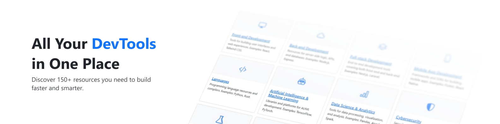
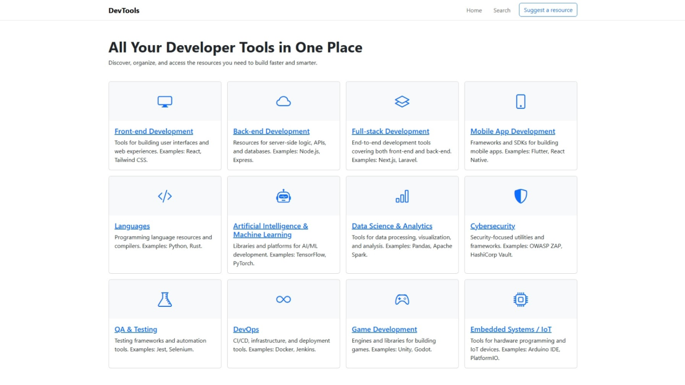
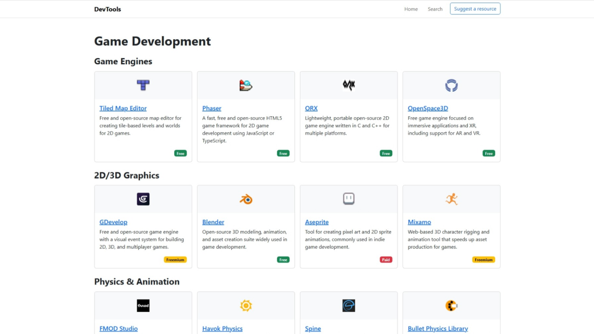
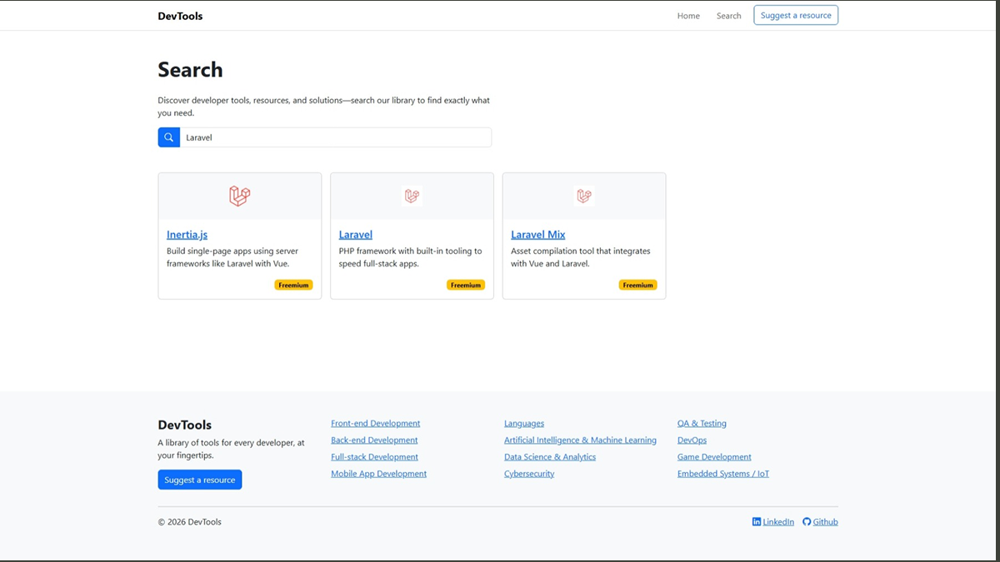

# DevTools

A web app that lists 150+ developer tools organized by categories and subcategories. It provides a searchable directory to help developers discover useful resources quickly.

## Project Highlights
- **MVC Laravel app:** Built with PHP and Laravel using controllers, routes, Eloquent models, and Blade layouts/components.
- **Structured database setup:** Uses migrations and seeders, with the initial database implemented through JSON files and SQLite for local development, plus XAMPP support in the original setup.
- **Frontend and UI:** Combines HTML, CSS, Bootstrap, Laravel, and JavaScript for a clean responsive interface.
- **Practical app flow:** Includes category-based browsing, search, and resource management for a real directory-style user experience.





## How to Install and Run

- **Requirements:** PHP 8.1+ with `pdo_sqlite` enabled, Composer, and Node.js if you want to build assets.
- This project was originally developed and tested on Windows with XAMPP, so the steps below assume PHP is available through a local XAMPP install or an equivalent setup.
- Install PHP dependencies and copy the example env:

```bash
composer install
cp .env.example .env
```

- Use SQLite locally (recommended): edit `.env` to set the connection and file path, for example:

```env
DB_CONNECTION=sqlite
DB_DATABASE=database/database.sqlite
```

- Create the SQLite file and set permissions if needed:

```bash
mkdir -p database
type nul > database\database.sqlite
```

- Generate the application key, run migrations and seed the DB:

```bash
php artisan key:generate
php artisan migrate --seed
```

- Install frontend dependencies and build the assets so Laravel can generate `public/build/manifest.json`:

```bash
npm install
npm run build
```

- If you are developing locally, you can use `npm run dev` instead of `npm run build` to serve assets through Vite.

## How to Use

- Start the development server:

```bash
php artisan serve
```

- Open your browser at `http://127.0.0.1:8000` and use the search box to find resources by name, description, or URL.
- Browse categories and subcategories from the UI to see grouped resources.
- To update or add data, edit the JSON files in `database/data/` and re-run the relevant seeders:

```bash
php artisan db:seed --class=\Database\Seeders\CategoriesSeeder
php artisan db:seed --class=\Database\Seeders\SubcategoriesSeeder
php artisan db:seed --class=\Database\Seeders\ResourcesSeeder
```

## Troubleshooting
- If Laravel seems to cache configuration changes, clear caches:

```bash
php artisan config:clear
php artisan route:clear
php artisan view:clear
```

- If you see `Vite manifest not found at public/build/manifest.json`, run `npm install` and `npm run build` in a fresh clone, or use `npm run dev` while the Vite dev server is running.

- If you encounter JSON seeder import issues, verify the JSON structure in `database/data/` and ensure the seeders are extracting `data` arrays when phpMyAdmin-wrapped exports are present.